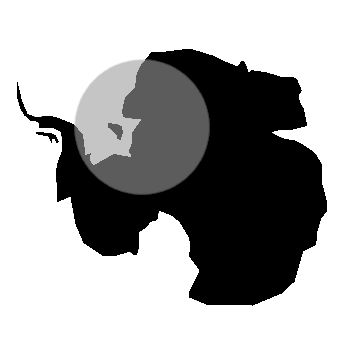

# QMapCompare

 

A QGIS plugin that enables you to compare maps smoothly.

(QGIS version 3.34 and above is required)

© OpenStreetMap Contributors
© Geospatial Information Authority of Japan

### Usage

- On left bottom panel, select comparing layers and click on one of the following buttons to start comparison:
  -  Mirror
  -  Vertical split
  -  Horizontal split
  -  Lens
- Map are updated on the fly when toggling comparing layers.
- Click on `Stop` button to end comparison.

### Notes
- On `Mirror` mode, a synchronized map view panel is added, but panel position and size are to be set by user.
- On `Split` and `Lens` mode, a masking group layer `QMapCompare_Group` where comparing layers are duplicated in is added. Editing this group manually may cause unexpected visualization.

### Authors

- Raymond Lay ([@bordoray](https://github.com/bordoray)) - original author
- And all contributors

